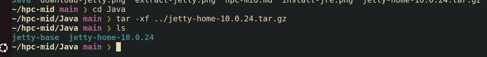

# XWiki installation
## System update (optional)
1. Open your favourite terminal emulator

2. Run following commands:
    ```sh
        sudo apt update && sudo apt upgrade
    ```

3. When asked to confirm press Enter

4. Wait for update to finish. You should see output like this:
    

## Jetty installation
1. Install Java Runtime Environment
    ```sh
        sudo apt install default-jre
    ```
    

2. Download jetty from [jetty.org](https://jetty.org/download.html)
    

3. I will download it into current directory using wget
    ```sh
        wget https://repo1.maven.org/maven2/org/eclipse/jetty/jetty-home/10.0.24/jetty-home-10.0.24.tar.gz
    ```
    

4. Create Java and Java/jetty-base folders
    ```
        mkdir -p Java/jetty-base
    ```

5. Extract the downloaded file into Java folder
    ```sh
        cd Java
        tar -xf jetty-home-10.0.24.tar.gz
    ```
    

6. Install jetty server
    ```sh
        mv jetty-home-10.0.24 jetty-home
        cd jetty-base
        java -jar ../jetty-home/start.jar --add-module=server,http,deploy
    ```
    

7. Testing jetty with demos
    ```sh
        java -jar ../jetty-home/start.jar --add-module=demo
        java -jar ../jetty-home/start.jar
    ```
    
    

8. Open browser at localhost:8080 to verify that demo is running
    
